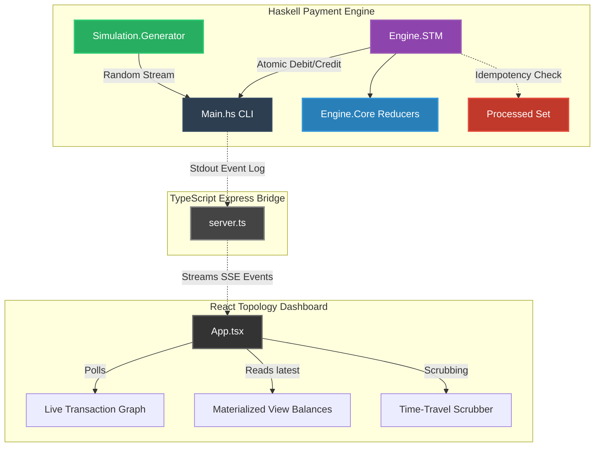

# Payment Engine — Deterministic Payment Simulation with Time-Travel Debugging

A production-grade Haskell project demonstrating advanced functional programming,
distributed systems design, and correctness-by-construction for a fintech context.

---

## 🏗️ Full-Stack Architecture

The system consists of a **Haskell Functional Core** processing high-throughput transactions using Software Transactional Memory (STM), connected to a **React Topology Dashboard** via a **TypeScript Server-Sent Events (SSE) Bridge**.



---


### Key Design Decisions

| Decision | Why |
|---|---|
| GADT phantom types for `Transaction s` | Invalid state transitions are compile-time errors |
| Event sourcing (`[Event] → SystemState`) | Time-travel is a free consequence; state is always recomputable |
| Tagless Final DSL | Zero-cost abstraction; swap interpreters without changing flows |
| STM over locks | Composable, deadlock-free concurrent transactions |
| Money as `newtype Int` (minor units) | No floating-point rounding errors |
| `conservationCheck` as a type-level invariant | Tested by QuickCheck with 500 random event sequences |

---

## Folder Structure

```
payment-engine/
├── payment-engine.cabal       # build + dependency manifest
├── stack.yaml                 # resolver: lts-22.39 (GHC 9.6.6)
├── app/
│   └── Main.hs                # CLI (imperative shell, all IO here)
├── src/
│   ├── Domain/
│   │   ├── Types.hs           # GADTs, ADTs, phantom types
│   │   └── StateMachine.hs    # pure state transitions
│   ├── Engine/
│   │   ├── Core.hs            # applyEvent, replay, replayUntil
│   │   ├── DSL.hs             # Tagless Final payment DSL
│   │   └── STM.hs             # concurrent simulation
│   ├── Observability/
│   │   └── Metrics.hs         # pure structured logging + metrics
│   └── Simulation/
│       └── Generator.hs       # deterministic event generation
└── test/
    └── Spec.hs                # QuickCheck + Hspec property tests
```

---

## Prerequisites

Install GHC and Stack:

```bash
# Windows (via GHCup)
winget install GHCup.GHCup
ghcup install ghc 9.6.6
ghcup install stack

# macOS / Linux
curl --proto '=https' --tlsv1.2 -sSf https://get-ghcup.haskell.org | sh
```

---

## Build & Run

```bash
cd payment-engine

# Build everything
stack build

# Run the simulation (1000 users, 10000 transactions, 8 workers)
stack exec payment-engine -- simulate --users 1000 --txns 10000 --workers 8

# Time-travel: inspect state at event #500
stack exec payment-engine -- replay --until 500 --txns 10000

# Adversarial scenarios
stack exec payment-engine -- scenario --name race
stack exec payment-engine -- scenario --name fraud
stack exec payment-engine -- scenario --name timeout

# Run property tests (500 QuickCheck iterations each)
stack test
```

---

## 🌐 Running the Dashboard (Frontend + Bridge)

The project includes a React dashboard and an Express SSE (Server-Sent Events) bridge that streams live transaction data from the Haskell engine to the browser.

```bash
# From the root of the project:
npm install

# Start the Node Express Server (bridge) AND the React Vite Server
npm run dev:all
```
Open **`http://localhost:3000`** in your browser. The dashboard connects to the bridge, spawns the Haskell engine, and renders the concurrent transactions on a live React Flow canvas.

---

## What Each Module Demonstrates

### `Domain.Types` — GADTs as proofs
```haskell
data Transaction (s :: TxStatus) where
  TxInitiated  :: ... -> Transaction 'Initiated
  TxAuthorized :: { authBase :: Transaction 'Initiated, ... } -> Transaction 'Authorized
  TxCaptured   :: { capBase  :: Transaction 'Authorized, ... } -> Transaction 'Captured
```
`authorize :: Transaction 'Initiated -> ... -> Transaction 'Authorized`
You literally cannot call `authorize` on a `Transaction 'Captured`. The compiler rejects it.

### `Engine.Core` — Time-travel as a fold
```haskell
replay :: [Event] -> Map AccountId Money -> SystemState
replay events initial = foldl applyEvent (emptySystemState initial) events

replayUntil :: Int -> [Event] -> Map AccountId Money -> SystemState
replayUntil n events = replay (take (n + 1) events)
```

### `Engine.DSL` — Tagless Final
```haskell
-- Write the flow once:
standardFlow txId from to amt method authCode batchId t0 t1 t2 t3 = do
  r0 <- dslInitiate txId from to amt method t0
  ...  >> dslAuthorize >> dslCapture >> dslSettle

-- Run it with the pure interpreter (tests):
runPure initialState (standardFlow ...)

-- Run it with the logging interpreter (production):
runLogging (standardFlow ...)
```

### `Engine.STM` — Concurrent consistency
```haskell
-- The entire debit/credit is one atomic STM transaction.
-- Either both accounts update or neither does.
atomically $ do
  senderBal <- readTVar senderV
  when (senderBal < amt) retry   -- STM retries automatically when balance changes
  writeTVar senderV (senderBal - amt)
```

### `test/Spec.hs` — QuickCheck properties
```
✓ money is conserved across any event sequence     (500 tests)
✓ event application is idempotent                  (500 tests)
✓ replay is deterministic                          (500 tests)
✓ no negative balances from valid transactions     (500 tests)
✓ only capture moves balances                      (500 tests)
✓ replayUntil n is a prefix of full replay         (500 tests)
✓ failed transactions don't move money             (500 tests)
```

---

## What Makes This Stand Out

1. **Types as proofs** — The GADT phantom type system makes invalid payment state transitions a compile error, not a runtime bug.
2. **Event sourcing + time-travel** — `replay` is a pure fold. Debugging any historical state is `replayUntil n`.
3. **Tagless Final DSL** — Payment flows are written once and interpreted differently in test vs. production with zero runtime cost.
4. **STM correctness** — The `retry` primitive means "wait until the precondition is true" — no polling, no locks, no deadlocks.
5. **Money conservation as a QuickCheck law** — 500 randomly generated event sequences all pass the conservation invariant.
6. **Functional core / imperative shell** — Every function in `src/` is pure. All IO is in `app/Main.hs`.
